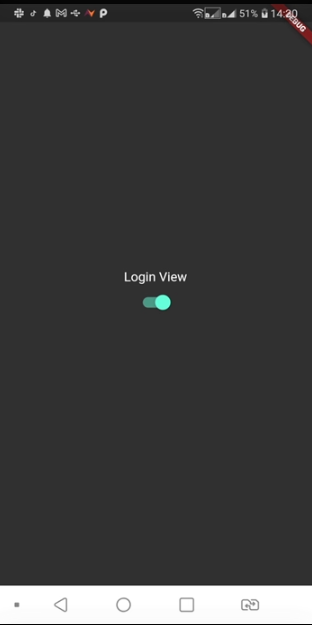
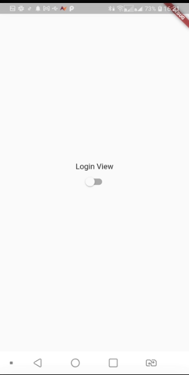

# ARCH-01

- Tela Home
- Tela Login
- Pasta components
- Pasta controller
- Pasta views

## Getting Started

Este projeto foi realizado e baseado nos principios SOLID de arquitetura.

Utilizaremos a arquitetura - SRP(single-responsability-principle).

- [Flutterando: Semana da Arquitetura](https://www.youtube.com/playlist?list=PLlBnICoI-g-c_ZIHqzQjg5E4Re92-qYXn)


### Screenshots 

 


<h2>Detalhes de Configuracao</h2>
  
  + Flutter channel: stable 
  + Flutter: versao 3.0.2
  + Dart: versao 2.17.3
  + Design Pattern: MVVM
  + Dependencias Utilizadas:  
    - intl: 
    

<h2>Como rodar o projeto</h2>

  + [Build_Mobile]

    ```
    $ clone o projeto
    $ cd nome-projeto
    $ flutter build run

    ```

## Candidato/Desenvolvedor

Seguem meu perfil do Linkedin, [@devtvas](https://www.linkedin.com/in/devtvas/).